# Sub-5 Unified Architecture & Failure Mode Forensics

**Date:** 2026-09-07  
**Scope:** ARC Prize 2026 / ARC-AGI-2 Hybrid Solution Architecture  
**Document Type:** Technical Retrospective, Bug Forensics & Production Architecture Blueprint  
**Authors:** AI Research & Kaggle Competition Engineering Team  

---

## 1. Executive Summary & Historical Progression

Between Submissions 1 through 4, our team encountered several subtle failure modes that masked the true capabilities of the test-time training (TTT) pipeline:

| Submission | Public LB Score | Apparent Behavior | Actual Underlying Reality (Forensic Truth) |
|---|---|---|---|
| **Sub 1** | **0.00%** | Crash | Unsloth / Torch ABI incompatibility during module initialization. |
| **Sub 2** | **0.00%** | Crash | C-extension symbol clash in custom kernel loader. |
| **Sub 3** | **30.14%** | Working Run | **Silent failure:** 688/688 sequences experienced `loss=0.0` due to right-truncation masking all target tokens. Neural TTT contributed **0 predictions**. Score was 100% produced by 7 symbolic rule solves + 252 raw identity input fallbacks! |
| **Sub 4** | **28.06%** | Regressed Score | **Path drift & debug filter:** `starter.py` resolved to evaluation challenges with a 4-key debug filter, discarding all neural shards during evaluation. Score was 100% produced by 259 raw identity input fallbacks. |
| **Sub 5** | **In Flight** | Unified Architecture | All critical bugs fixed (left-truncation, $r=256$ RSLoRA, zero-loss guard, single `--test-path` source of truth, pure consensus `score_kgmon`, 4× L4 GPU saturation). |

The key takeaway is that **prior to Sub-5, our neural TTT engine had never actually trained or predicted on a single valid test token on the leaderboard**. The 30.14% baseline score was achieved entirely on the back of 7 deterministic symbolic solves and identity fallback grids.

---

## 2. Forensic Investigation: Sub-3 Silent Loss=0.0 Post-Mortem

### 2.1 The Log Evidence
Analysis of the raw execution logs (`e2ycbBHJ.txt` and `SHLZdp-z.txt`) from Sub-3 revealed the following irrefutable metrics:

```
Total training stats lines in Sub-3 log: 688
Training loss = 0.0:  688 / 688 (100.0%)
Global step = 16:     688 / 688 (100.0%)
Neural shards loaded: 0
Symbolic shards:      7
Fallbacks:            252 / 259
```

### 2.2 Root Cause: Right-Truncation of Target Sequences
The Qwen3-4B instruction prompt format structures ARC tasks as follows:
```
<|im_start|>user
[Task demonstrations and test input grid]
<|im_end|>
<|im_start|>assistant
[Target output grid completion]
<|im_end|>
```

In `arc_loader.py` and HuggingFace's tokenizer, the default parameter was:
```python
tokenizer.truncation_side = "right"  # HuggingFace default
```

When an ARC-AGI-2 prompt exceeded the maximum sequence length of 8,192 tokens:
1. Right-truncation chopped off the **tail** of the sequence.
2. The tail of the sequence is precisely where the `<|im_start|>assistant` target turn lives.
3. The custom completion collator (`QwenDataCollatorForCompletionOnlyLM`) assigns label mask `-100` to everything in the user turn, and only computes cross-entropy on tokens inside the assistant response.
4. Because right-truncation wiped out the entire assistant turn, **every single token in the batch received label `-100`**.
5. With zero supervised tokens, PyTorch cross-entropy loss evaluated to `0.0`.

### 2.3 The False Convergence Trap
In `arc_solver.py`, the early-stopping callback was implemented as:
```python
class EarlyStoppingOnLossCallback(TrainerCallback):
    def on_log(self, args, state, control, logs=None, **kwargs):
        if logs is not None and "loss" in logs:
            if logs["loss"] < self.threshold:  # self.threshold = 5e-4
                control.should_training_stop = True
```

Because `0.0 < 0.0005`, the callback falsely interpreted `loss = 0.0` as "instant, perfect convergence" at step 16! The trainer terminated training immediately, saving adapter weights that had never received a single non-zero gradient update.

---

## 3. Forensic Investigation: Sub-4 Path Drift & Debug Gate

In Sub-4, the score dropped from 30.14% to 28.06%. Forensics revealed two catastrophic plumbing flaws:

1. **Path Divergence:** The top-level notebook cell resolved `test_path`, but `starter.py` was invoked as an external process without `--test-path`. It independently resolved paths and fell back to `arc-agi_evaluation_challenges.json`.
2. **Debug Filter Gate:** In `starter.py`, `rerun_mode` was checked. Because `KAGGLE_IS_COMPETITION_RERUN` is not set during local testing or manual commits, a hardcoded 4-key debug filter activated:
   ```python
   debug_keys = ["0934a4d8", "36a08778", "981571dc", "aa4ec2a5"]
   keys = [k for k in keys if k in debug_keys]
   ```
3. **Shard Key Mismatch:** The few shards that were generated had keys from the evaluation set rather than the hidden test set. When `ArcDecoder` loaded shards from `/kaggle/inference_outputs`, 0 shards matched the test set keys.
4. **Pure Fallback Output:** The decoder fell back to input identity for all 259 outputs, scoring exactly 28.06% (the pure mathematical floor of the ARC-AGI-2 benchmark).

---

## 4. The Master Architecture for Sub-5

Sub-5 merges the expert's critical plumbing fixes with high-throughput hardware optimizations into a single unified pipeline:

```mermaid
graph TD
    subgraph "1. Critical Plumbing Fixes"
        A[Unify Test Path: Pass --test-path explicitly to starter.py]
        B[Left-Truncation: tokenizer.truncation_side = 'left']
        C[Zero-Loss Guard: Disallow loss <= 0.0 early stopping]
    end

    subgraph "2. Hardware Capacity Unleash (4x NVIDIA L4 24GB)"
        D[Scale LoRA Rank: r=256 with RSLoRA]
        E[Disable Gradient Checkpointing: ~30% faster backprop]
        F[Double DFS Decode Batch: decode_batch = 4]
        G[Full Augmentation: Keep 16 augments across all tasks]
    end

    subgraph "3. Scoring & Candidate Assembly"
        H[Revert to Pure score_kgmon: Vote Count - Mean Augmented NLL]
        I[Exact Symbolic Pre-Pass Bonus: +1000.0 points]
    end

    subgraph "4. Execution Safety & Quota Architecture"
        J[Second-0 Fallback Pre-population]
        K[Dual-Mode Fast Commit: 0 tasks in commit, 11.83h in scoring]
    end

    A --> SUB5[Sub 5: Unified Production Pipeline]
    B --> SUB5
    C --> SUB5
    D --> SUB5
    E --> SUB5
    F --> SUB5
    G --> SUB5
    H --> SUB5
    I --> SUB5
    J --> SUB5
    K --> SUB5
```



---

## 5. Detailed Component Changes & Code Diffs

### 5.1 `arc_solver.py`: Left-Truncation & Hardware Scaling

```python
# 1. Force Left-Truncation (Target Preservation)
model, tokenizer = FastLanguageModel.from_pretrained(
    model_name=model_dir,
    full_finetuning=False,
    load_in_4bit=_load_4bit,
    local_files_only=True,
    use_gradient_checkpointing=False,  # Disabled for 30% speedup on 24GB L4
    max_seq_length=max_seq_length,
)
tokenizer.truncation_side = "left"  # Crucial: cuts input context, preserves assistant targets!

# 2. Zero-Loss Guard
class EarlyStoppingOnLossCallback(TrainerCallback):
    def on_log(self, args, state, control, logs=None, **kwargs):
        if logs is not None and "loss" in logs:
            # Loss must be strictly positive: loss <= 0.0 indicates missing labels (-100 mask), NOT convergence
            if 0.0 < logs["loss"] < self.threshold:
                control.should_training_stop = True

# 3. RSLoRA Rank 256 Configuration
peft_params = dict(
    r=256,              # Quadrupled capacity for complex geometric ARC rules
    target_modules=["q_proj", "k_proj", "v_proj", "o_proj", "gate_proj", "up_proj", "down_proj", "embed_tokens", "lm_head"],
    lora_alpha=256,     # Consistent alpha scaling
    use_rslora=True,    # Stabilizes gradient flow at large ranks
    use_gradient_checkpointing=False,
)
```

### 5.2 `starter.py`: Unified Path Handling & Task Orchestration

```python
# 1. Explicit CLI Path Propagation
parser.add_argument("--test-path", type=str, default="")
args, _ = parser.parse_known_args()

if args.test_path and os.path.exists(args.test_path):
    test_path = args.test_path
else:
    test_path = resolve_challenges_path(prefer_test=True)

# 2. Symbolic Pre-Pass (Banks 7 free solves in 2 seconds)
if not args.skip_symbolic:
    solved_tasks = run_symbolic_prepass(data, keys)
    if solved_tasks:
        keys = [k for k in keys if k not in set(solved_tasks)]
        print(f"[starter] Excluded {len(solved_tasks)} symbolically solved tasks from GPU queue")
```

### 5.3 `arc_decoder.py`: Pure `score_kgmon` Consensus with Symbolic Bonus

```python
def score_kgmon(guesses: Dict[str, Any], **kwargs) -> List[np.ndarray]:
    guess_list = list(guesses.values())
    scores = {}
    for g in guess_list:
        h = hashable(g["solution"])
        x = scores.setdefault(h, [[], g["solution"], g.get("is_symbolic_exact", False)])
        x[0].append(g)
        if g.get("is_symbolic_exact", False):
            x[2] = True

    ranked = []
    for sc_list, sol, is_exact in scores.values():
        inf_score = len(sc_list)
        aug_nlls = [np.mean(g["score_aug"]) for g in sc_list if len(g.get("score_aug", []))]
        mean_aug = float(np.mean(aug_nlls)) if aug_nlls else 0.0
        score = inf_score - mean_aug
        if is_exact:
            score += 1000.0  # Guarantees exact deterministic symbolic rules rank #1
        ranked.append((score, np.asarray(sol)))

    ranked.sort(key=lambda x: x[0], reverse=True)
    return [x[1] for x in ranked]
```

---

## 6. Execution Lifecycle & Quota Accounting

The unified pipeline strictly separates manual commit runs from official competition scoring reruns:

1. **Commit Phase (`RERUN=False`)**:
   - Skips Phase 1 & Phase 2.
   - Pre-populates baseline `submission.json` and verifies schema across all 240 tasks.
   - Runs in **249 seconds (~4.1 minutes)**, consuming only **0.06 hours** of the user's weekly 30h personal quota.
   - Unlocks the "Submit to Competition" button immediately.
2. **Competition Scoring Phase (`RERUN=True`)**:
   - Kaggle injects the hidden private test dataset.
   - Sets `KAGGLE_IS_COMPETITION_RERUN=1`.
   - Runs for the full **11 hours 50 minutes** across all 4× NVIDIA L4 GPUs on **Kaggle's dedicated competition compute (0 personal quota used)**.

---

## 7. Submission Artifacts & Verification Snapshot

- **Live Submission Reference:** `56072851` (`arc2-hybrid-v5-demo`)
- **Archived Directory:** [`submission/pre-sub-v5-demo/`](file:///home/arch/ipynb/duplicate/submission/pre-sub-v5-demo/)
- **Notebook File:** `arc2-hybrid-v5-demo.ipynb` (12 cells, validated schema, fail-safe architecture)
- **Execution Log:** `pre-sub-v5-demo.txt` (249.1s clean commit log)
